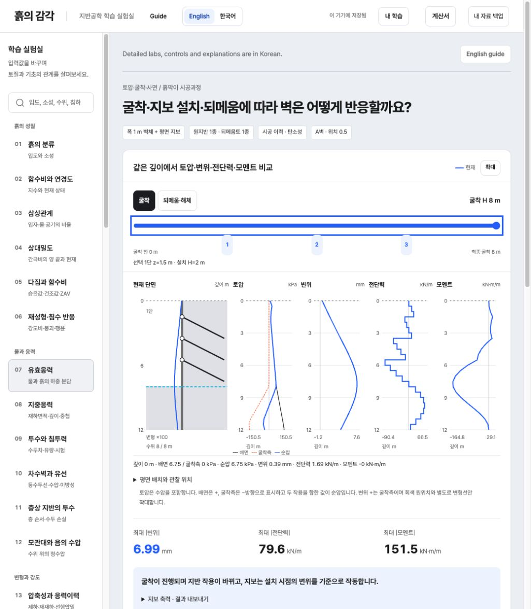
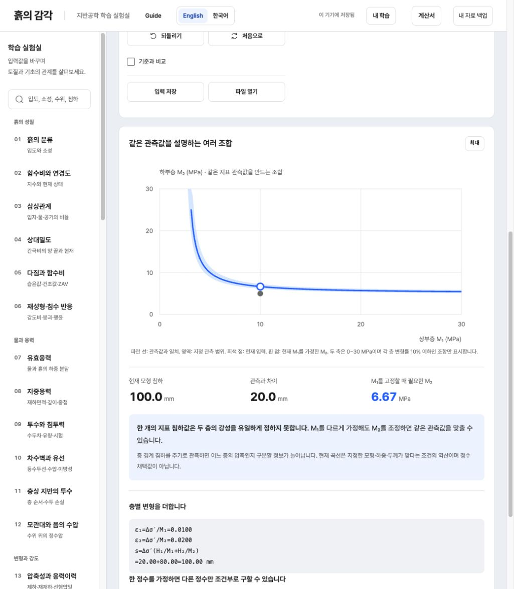

# Geotech Lab · 흙의 감각

[English](README.md) · **한국어**

지반공학의 입력·가정과 계산 결과를 연결하고, 계측으로 알 수 있는 것과 없는 것을 살펴보는 대화형 학습 도구입니다. 40개 한국어 실험과 얕은기초 계산서, 영어·한국어 소개 화면을 제공합니다. 소개 언어는 브라우저에 저장하며 상세 실험·입력·계산 근거는 한국어로 제공합니다.

처음 방문했다면 **단계별 굴착·지보**에서 시공 순서에 따른 벽체와 지보의 응답을 살펴보세요. 이어서 **층별 침하 역산의 비유일성**에서 하나의 관측값을 서로 다른 물성 조합이 만족하는 이유를 확인할 수 있습니다. [대표 예제의 입력·식·결과·검증](docs/examples.md)은 영어로 정리했습니다. 두 예제는 가정한 입력을 사용하지만 앱 전체에는 출처가 있는 실제 공개 시험자료도 포함됩니다.

## 대표 예제

[공개 데모 열기](https://geotech-lab-public.geotech-tools.workers.dev/) · [로컬 실행](#내-컴퓨터에서-실행하기) · [검증 범위](docs/validation.md)

### 1. 단계별 굴착·지보



굴착·설치·긴장·되메움·해체에 따른 변위, 전단력, 휨모멘트와 지보 축력을 비교합니다. Euler–Bernoulli 보와 탄소성 지반 스프링, 단순화한 지보 전달 모형을 사용하며 실제 현장이나 상용 해석 프로그램과의 수치적 동등성을 주장하지 않습니다. [모형과 한계](docs/excavation-staged.md).

### 2. 층별 침하 역산



같은 지표 침하 관측값에 대해 상부층 구속계수의 가정에 따라 하부층 구속계수가 달라짐을 확인합니다. 균등한 유효응력 증가, 배수 완료, 층별 일정 구속계수를 가정합니다. [식과 역산의 비유일성](docs/layered-case.md).

## 내 컴퓨터에서 실행하기

Node.js 22 이상, npm과 Git을 준비합니다.

```sh
git clone https://github.com/geotech-0/geotech-lab-public.git
cd geotech-lab-public
npm ci
npm test
npm run build
npm start
```

<http://127.0.0.1:8766>에서 엽니다. `npm run build`는 `dist-public/index.html`을 만들고 `npm start`는 이 공개용 앱을 제공합니다. `npm run build:public`도 같은 빌드입니다. 생성된 HTML에는 계산 코드·폰트·선택 시험자료가 들어 있으며, 원자료 제공기관의 링크를 열 때는 인터넷이 필요합니다. 소스 수정 후에는 다시 빌드하고 화면을 새로고침하세요.

공개판에는 계정 로그인과 작업공간 동기화 UI가 없습니다. 실험 입력·학습 기록·계산서는 현재 브라우저에 저장합니다. 코드 저장소를 복제해도 브라우저의 개인 자료가 복제되지는 않습니다.

## 자료 저장과 옮기기

상단 **내 자료 백업**에서 실험 전체 입력·질문·비교 기준, 내 예제·복습 기록, 계산서를 한 JSON으로 내보내고 가져옵니다. 현재 실험만 옮길 때는 **입력 저장 / 파일 열기**를 사용합니다. 가져오기 미리보기에서 내용을 확인한 뒤 적용합니다.

- 새 개별 실험 파일은 버전 5이며 기존 버전 1–4와 계산서 버전 1도 읽습니다. 이전 흙막이 파일은 원래 선형 해석으로 읽어 결과의 의미를 보존합니다.
- 전체 작업공간 백업은 6 MiB 범위입니다. 한도를 넘으면 기존 자료를 지우거나 축약하지 않고 안내합니다.
- 다른 탭에서 자료가 바뀌면 오래 열린 탭의 쓰기를 멈춥니다. 해당 탭의 작업을 내보낸 뒤 새로고침하세요.
- 사이트 주소·브라우저·로컬 파일마다 저장공간이 다를 수 있습니다. 자료 이동에는 JSON 내보내기·가져오기를 사용하세요.

자세한 형식과 복원 규칙은 [저장 파일 문서](docs/session-files.md)에 있습니다. 중요한 작업은 브라우저 저장소와 별도로 JSON 파일을 보관하세요.

## 기능과 검증

입력 조절·비교 기준·단위와 핵심식·문맥 도움·그래프 확대·내 예제·복습 기록을 제공합니다. 별도 계산서는 얕은기초의 하중 장부·접촉·지지력을 정리합니다. [학습 기능과 계산 범위](docs/learning-guide.md), [개발 안내](docs/development.md), [검증 범위](docs/validation.md)를 참고하세요.

```sh
npm test
npm run build
node examples/run.mjs
```

계산·입력 파일·저장 계약과 공개 빌드를 검사합니다. 원본 USGS Excel·USACE PDF가 제외된 공개 배포본에서는 원본 바이트·셀 대조 검사 3개를 명시적으로 건너뛰며, 선택한 수치자료와 엔진의 일치·계산 검사는 유지합니다. 자동 검사는 외부 전문가의 독립 검토나 실제 학습자 연구, 현장 적합성 검증을 대신하지 않습니다.

## 출처와 재사용

[외부 자료 목록](docs/third-party-materials.md)은 실제 공개 시험자료, 원그림에서 판독한 수치와 가정한 예제를 구분합니다. USGS 원본 Excel과 USACE 발췌 PDF는 이 저장소와 공개 빌드에 포함하지 않으며 선택 수치와 제공기관 원문 링크를 제공합니다. Amaliahaven은 CC BY 4.0으로 공개된 실제 현장 시험자료이며 합성자료나 앱 작성자의 직접 계측으로 표시하지 않습니다.

애플리케이션 코드에는 오픈소스 라이선스를 부여하지 않았습니다. [저작권·라이선스 안내](COPYRIGHT.md)를 확인하세요. Pretendard의 [OFL](assets/fonts/OFL.txt)과 제3자 시험자료의 개별 라이선스·출처·가공 설명은 그대로 적용됩니다.
