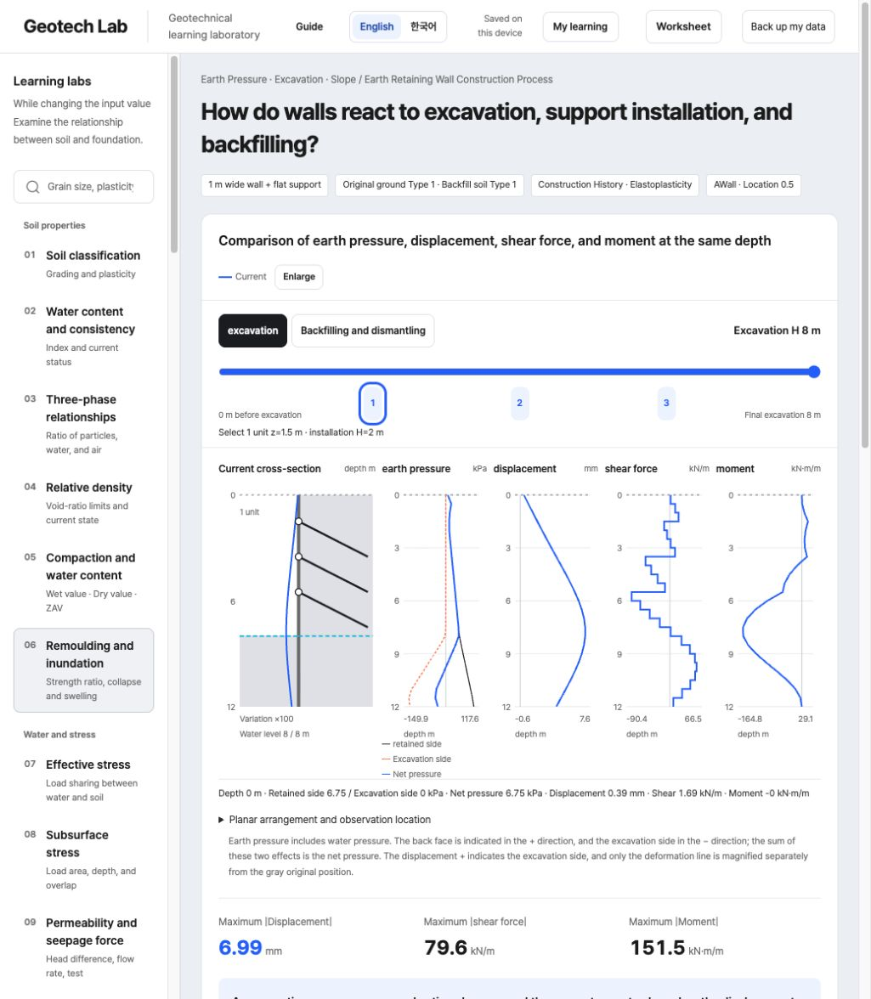
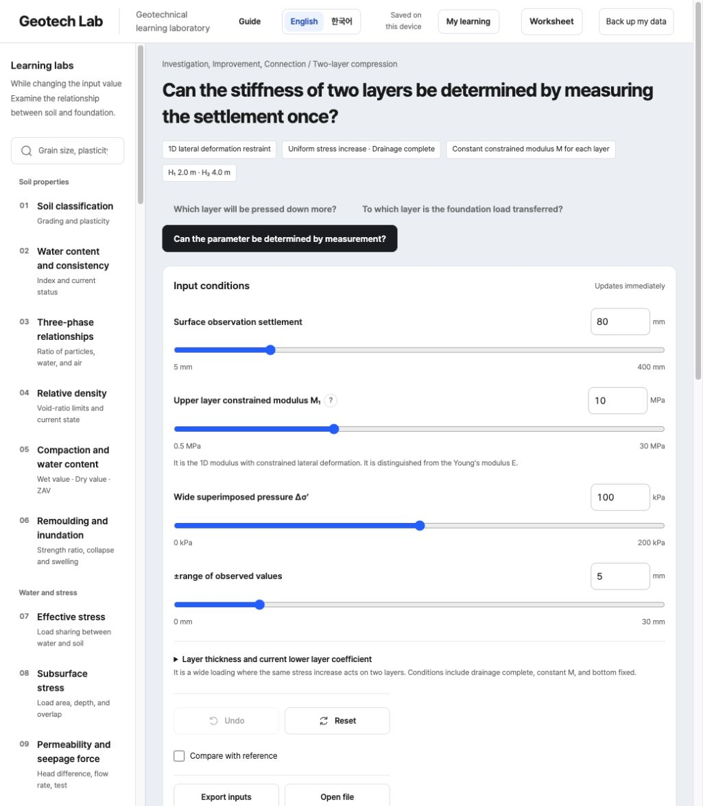
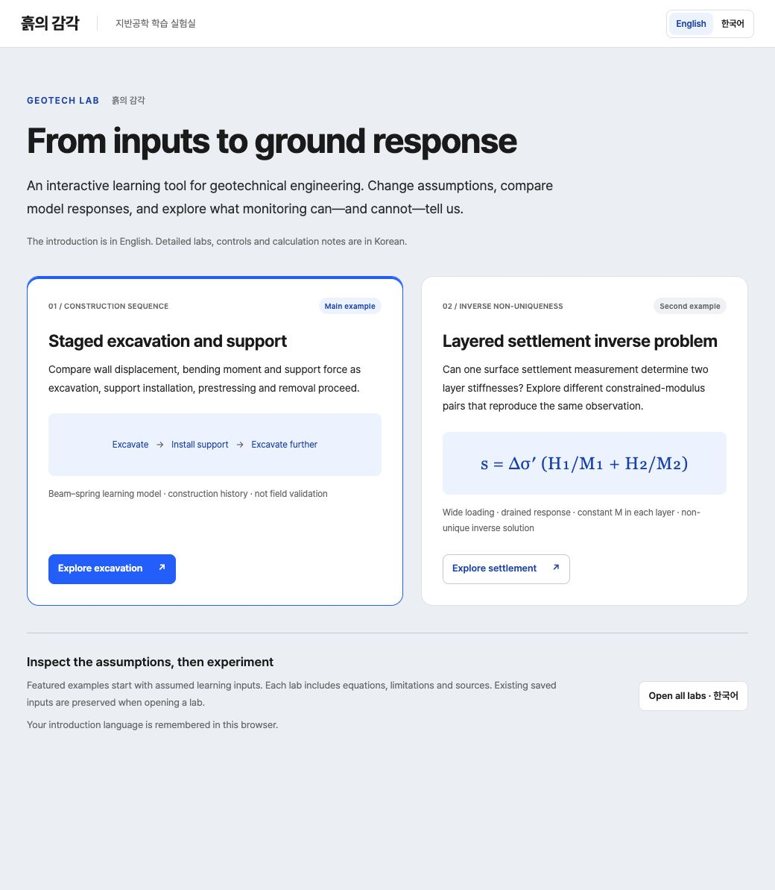

# Geotech Lab · 흙의 감각

**English** · [한국어](README.ko.md)

An interactive geotechnical engineering learning tool for exploring how assumptions and inputs change ground response. It connects equations, editable parameters, comparison plots, and source notes across 40 labs and a shallow-foundation worksheet, with English and Korean interfaces.

Start with **staged excavation**: follow wall movement, bending moment, shear, and support forces through excavation, installation, lock-off, and backfill. Then explore **settlement inverse non-uniqueness**: see why one settlement observation cannot uniquely determine two layer moduli. The English/Korean introduction links to both examples. Switch the complete interface—including controls, dynamic results, plots, help, errors, and the worksheet—without resetting inputs. The selected language is remembered in the current browser.

[Try the live demo](https://geotech-lab-public.geotech-tools.workers.dev/) · [Reproduce the examples](docs/examples.md) · [Run locally](#run-locally) · [Validation scope](docs/validation.md)

## Featured examples

### 1. Staged excavation and support



Inspect four result curves as excavation, support installation, prestressing, backfill, and removal change the response. The model uses Euler–Bernoulli wall beams, elastoplastic soil springs, and simplified support transfer. It is an educational model, with no claim of field-calibrated accuracy or equivalence to commercial software. [Inputs, equations, results, and checks](docs/examples.md#1-excavation-installation-lock-off-and-backfill).

### 2. Layered settlement and a conditional inverse



Vary the upper-layer constrained modulus and find different lower-layer moduli that reproduce one synthetic surface-settlement observation. The example assumes a uniform stress increase, completed drainage, and constant constrained modulus in each layer. [Explore what one observation can identify](docs/examples.md#2-layered-settlement-and-a-conditional-inverse).

## Features

- Editable inputs, explicit units and assumptions, reference-state comparisons, and linked calculation notes.
- Forty labs covering soil properties, groundwater and stress, deformation and strength, earth pressure and slopes, foundations and piles, and investigation and improvement.
- Browser-local examples, review records, JSON backup/import, and a separate shallow-foundation worksheet.
- English/Korean navigation and detailed tools, with separate persisted language and calculation state.



[The Korean learning guide](docs/learning-guide.md) describes the full scope. The public app stores experiment inputs, learning records, and the worksheet in the current browser; it has no account login or workspace synchronization. JSON export/import moves work between browsers.

## Run locally

Requires **Node.js 22 or later**, npm, and Git.

```sh
git clone https://github.com/geotech-0/geotech-lab-public.git
cd geotech-lab-public
npm ci
npm test
npm run build
npm start
```

Open <http://127.0.0.1:8766>. `npm run build` creates the public app in `dist-public/index.html`, and `npm start` serves that directory. `npm run build:public` is an explicit alias for the same build. The HTML embeds the calculation code, font, and selected data; links to publisher-hosted originals require internet access. Edit `src/` and rebuild after a change. See [development](docs/development.md) for source layout and local checks.

```sh
node examples/run.mjs
```

The example runner checks the supplied assumed cases. Its JSON inputs are engine inputs, not browser session files.

## Validation and limits

Tests cover model hand calculations and invariants, input rejection, file compatibility, and software behavior. Excavation checks include beam solutions, force and moment equilibrium, support activation and lock-off, mesh/increment refinement, and history replay. [Validation](docs/validation.md) distinguishes the checks for selected data from checks requiring excluded original files, and gives reproducible commands.

These checks do not establish site suitability, independent professional approval, or equivalent results from SUNEX, GEOXD, or DeepEX. The tool does not provide a complete design acceptance decision. Read each model's assumptions before interpreting its output.

## Sources and reuse

The app includes assumed learning cases and published test records; it is **not an entirely synthetic dataset**. Model references, provenance, transformations, and material-specific terms are linked in [third-party materials](docs/third-party-materials.md). The original USGS workbook and USACE excerpt PDF are not bundled; selected numerical data and original-source links are retained.

Application code is provided without an open-source license grant. See [copyright and licensing](COPYRIGHT.md). Third-party data and font licenses retain their own terms.

Further reading: [excavation model](docs/excavation-staged.md) · [layered-settlement model](docs/layered-case.md) · [reference map](docs/reference-map.md).
